<!-- AUTO-GENERATED-CONTENT:START (STARTER) -->
<p align="center">
  <a href="https://www.gatsbyjs.org">
    
  </a>
</p>
<h1 align="center">
  MDS Mutual Aid Starter
</h1>

[](https://badge.fury.io/js/$npm_package_name)

_MORE @TODO_

- Replace `$npm_package_name` with actual name used to upload package to NPM

Kick off your city's mutual aid efforts as we all learn to cope with COVID-19 with this starter powered by Gatsby, Airtable, and community efforts.

## Overview

This project is aims to make it as easy as possible to launch and manage an index of resources in your city during the COVID-19 pandemic.

Using this template you can set up a relief resources site without touching any code.

**1. Get Ready**

- Secure a domain name
- Create your accounts
  - Create Github Account
  - Create Netlify Account or Zeit Account
  - Create Airtable Account

**2. Set up data source**

- Set up Airtable
- Get ready to deploy
  - Get keys for env variables

**3. Deploy your site**

- Click Deploy button
- Connect to Airtable, set City/State
- Configure domain name

**4. Go Live**

- Approve entries in Airtable
- Redploy your site on Netlify
- Add your site to the [directory](https://servicerelief.us/submit)
- Spread the word

**5. Local Development**

- Preparation steps
- Create .env file
- NPM link local theme repo

## 1️⃣ Get Ready

### Secure a domain name

Generally we're using the pattern `citynamemdsmutualaid.com` -- for example:

- [bostonmdsmutualaid.com](bostonmdsmutualaid.com)

### Create your accounts

First, you'll need to create a few accounts with free tiers from different software services.

#### 👉🏼 Create a GitHub Account

If you have a GitHub account, go ahead and [log in](https://github.com/join). If not, [sign up for an account](https://github.com/join).

#### 👉🏼 Create a Netlify Account

If you have a Netlify account, go ahead and [log in](https://app.netlify.com/signup). If not, [sign up for an account](https://github.com/join). (_Recommend logging in with GitHub._)

#### 👉🏼 Create an Airtable Account

If you have an Airtable account, go ahead and [log in](https://airtable.com/login). If not, [sign up for an account](https://airtable.com/signup).

## 2️⃣ Set up your data source

### Set up Airtable base

To set up Airtable, you can use a base template configured specifically for a relief resources site.

👉🏼 [Open the template (Version 2!)](https://airtable.com/addBaseFromShare/shrC4z0Iiugrw4npn?utm_source=airtable_shared_application) and click "Add base".

⚠️⚠️⚠️⚠️⚠️⚠️⚠️⚠️⚠️⚠️⚠️⚠️⚠️⚠️⚠️⚠️⚠️⚠️⚠️⚠️⚠️⚠️⚠️⚠️⚠️⚠️⚠️⚠️⚠️⚠️

###  IF YOU'VE PREVIOUSLY ADDED THE VERSION 1 TEMPLATE FOLLOW THE FOLLOWING FOUR STEPS:

⚠️ [Go ahead and add the version 2 template.](https://airtable.com/addBaseFromShare/shrm1Q96qZIxuMAqx?utm_source=airtable_shared_application) and click "Add base".

⚠️ Head to your table of resources from the version 1 template you added previously. Go ahead and select all of the rows you want to copy over, then hit `CTRL-C`.

⚠️ Head to the new table of resources you created from the version 2 template. Create a new row, then hit `CTRL-V`. When given the option, select `Expand the group so that all of the pasted cells will fit.` and hit `Continue`. 

⚠️ Lastly, make sure to manually set the `PageCategory` column for all of the rows you copied over - this is what binds them to a specific page of resources on your site.

⚠️⚠️⚠️⚠️⚠️⚠️⚠️⚠️⚠️⚠️⚠️⚠️⚠️⚠️⚠️⚠️⚠️⚠️⚠️⚠️⚠️⚠️⚠️⚠️⚠️⚠️⚠️⚠️⚠️⚠️

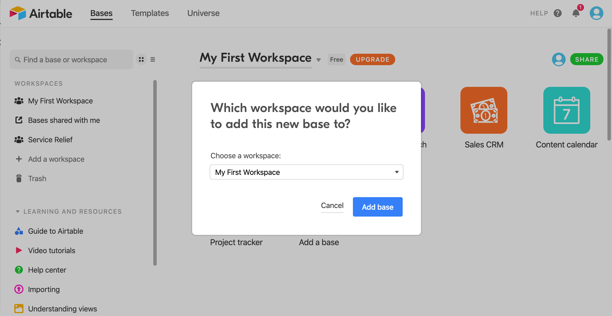

Then you should see several tiles that correspond to individual "Bases" that Airtable has set up for you. Look for "Relief Resources Template".

👉🏼 Hover over the "Relief Resources Template" tile, and click the "down" caret that appears. Replace the text **"Relief Resources Template"** with something like **"Relief Resources Boston"**. (_Use your city name_).

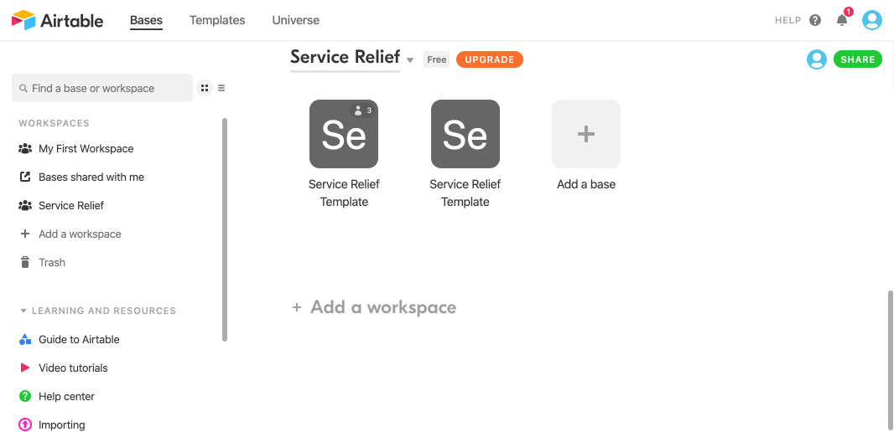

### Collect keys from Airtable

In order for your site to grab the data from your Airtable document, you'll need to collect **4 key values**.

Copy the following snippet into a text file.

```
AIRTABLE_API_KEY=key00000000000000
AIRTABLE_BASE_ID=app00000000000000
AIRTABLE_TABLE_NAME=tbl00000000000
AIRTABLE_EMBED_ID=shr0000000000000
```

#### Collect Airtable API key

> Your **API key** is secret, sort of like a key for a safe deposit box. Don't share it.

👉🏼 Visit your [Airtable account](https://airtable.com/account), and find the "API" section.

👉🏼 Click the "Generate API key" button.

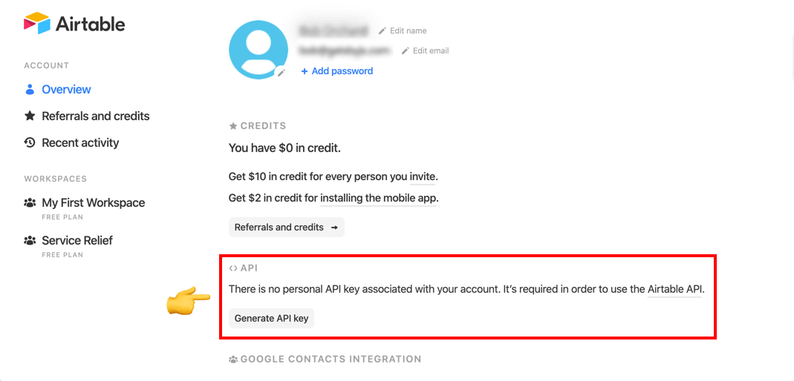

👉🏼 Click on the dots to show your key, and copy it.

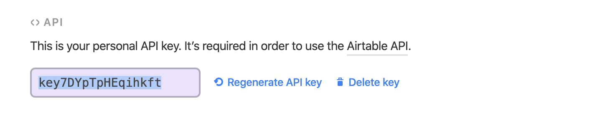

👉🏼 Paste the key in your text file as the value for `AIRTABLE_API_KEY`.

For example, if my key were `key123`, it would look like this:

```
AIRTABLE_API_KEY=key123
AIRTABLE_BASE_ID=app00000000000000
AIRTABLE_TABLE_NAME=tbl00000000000
AIRTABLE_EMBED_ID=shr0000000000000
```

#### Collect Airtable Base Id

👉🏼 Visit [the Airtable API page](https://airtable.com/api).

👉🏼 Click on the base you just created and renamed for your city.

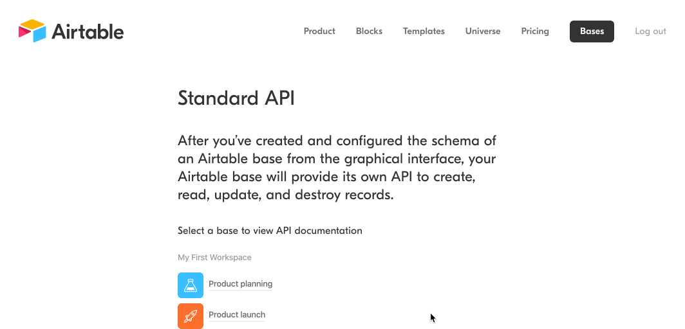

👉🏼 Copy the base id found halfway down the page (highlighted in the gif above).

👉🏼 Paste the id in your text file as the value for `AIRTABLE_BASE_ID`.

For example, if my key were `app123`, it would look like this:

```
AIRTABLE_API_KEY=key123
AIRTABLE_BASE_ID=app123
AIRTABLE_TABLE_NAME=tbl00000000000
AIRTABLE_EMBED_ID=shr0000000000000
```

#### Collect Airtable Table Id

👉🏼 Visit the Airtable base you've created for your city by visiting the [Airtable homepage](https://airtable.com/) and then clicking the tile for your base.

You can find your table id in part of the url. After `https://airtable.com/`, copy everything before the next `/`. For example, in the following URL:

`https://airtable.com/tbl6QXLCylcd2ukYr/viw0PQQWbtAfxZ8qa`

The part you need would be `tbl6QXLCylcd2ukYr`.

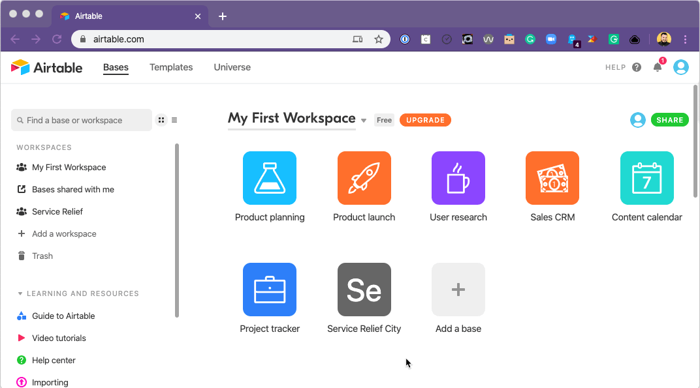

👉🏼 Paste the table id in your text file as the value for `AIRTABLE_TABLE_NAME`.

For example, if my table id were `tbl123`, it would look like this:

```
AIRTABLE_API_KEY=key123
AIRTABLE_BASE_ID=app123
AIRTABLE_TABLE_NAME=tbl123
AIRTABLE_EMBED_ID=shr0000000000000
```

#### Collect Airtable Embed Id

👉🏼 Click the "Grid View" at the top left of your base.

👉🏼 Select "Submit a Fundraiser". This will take you to the form view, a submission form created automatically, which corresponds to your Airtable base.

👉🏼 Click "Share Form". You should see a link. Copy everything after `https://airtable.com/`.

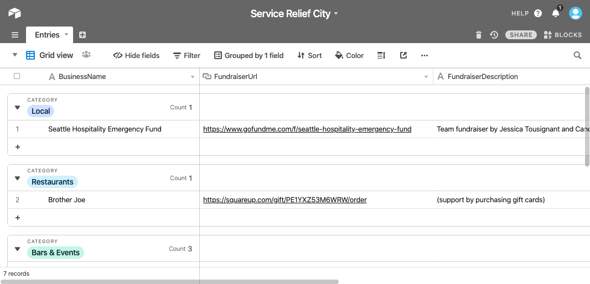

👉🏼 Paste the embed id in your text file as the value for `AIRTABLE_EMBED_ID`.

For example, if my table id were `shr123`, it would look like this:

```
AIRTABLE_API_KEY=key123
AIRTABLE_BASE_ID=app123
AIRTABLE_TABLE_NAME=tbl123
AIRTABLE_EMBED_ID=shr123
```

With all four values collected, you're ready to set up the site.

## 3️⃣ Deploy Your Site

### Deploy to Netlify

> _Note: We plan to set up instructions for other providers eventually, as well._

👉🏼 Click the button below to begin the process of deploying to Netlify.

[](https://app.netlify.com/start/deploy?repository=https://github.com/MayDayStrike/gatsby-starter-mds-mutual-aid)

👉🏼 Click "Connect to GitHub". (_You should already be logged in, but if you're not, log in_).

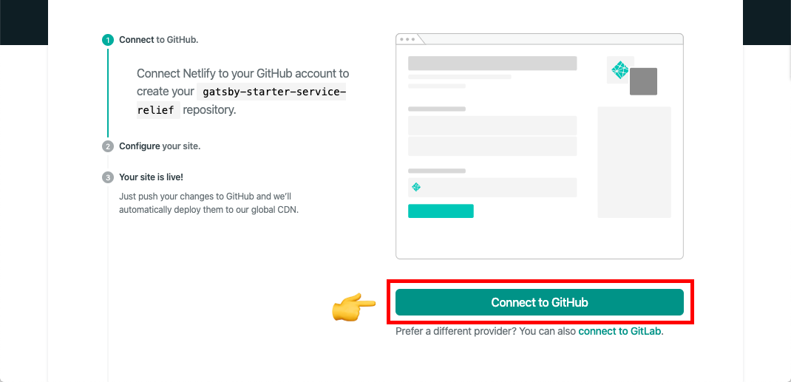

👉🏼 For the repository name, use something like `relief-resources-boston` (_using your city, of course_).

👉🏼 Use the text file with your four Airtable values to populate the prompts for API key, base id, table name, and embed id.

👉🏼 In the final two prompts, specify your city and state. (_We'll use this to personalize your site a bit_).

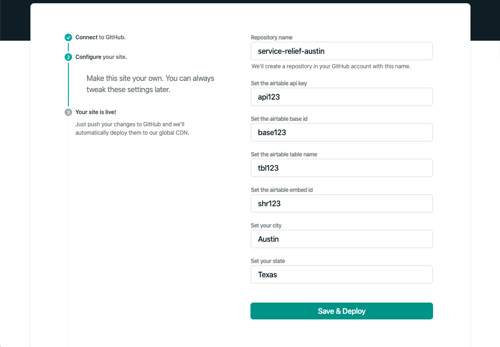

👉🏼 Click "Save and Deploy".

It will take a little while for your new site to build. You'll see the message "Site deploy in progress".

When the build is published, you'll see a live green link under the site title:

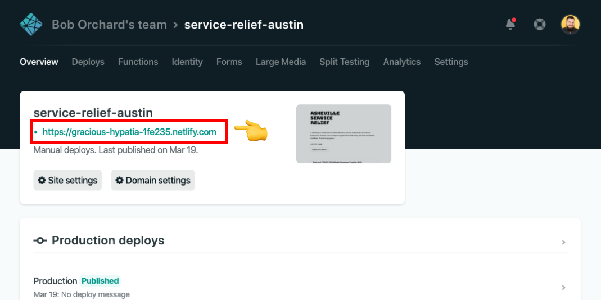

### Customize the site domain

You can set a custom domain in your Netlify site settings. From your site's main admin page on Netlify:

👉🏼 Click "Domain Settings".

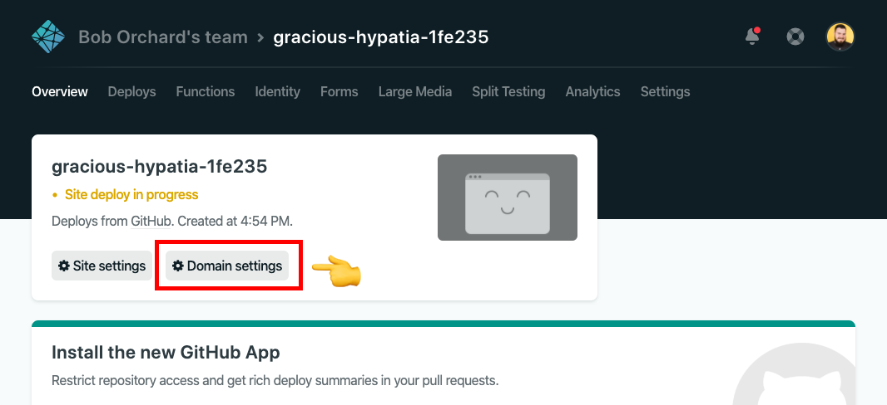

👉🏼 Under "Custom Domains", click "Add Custom Domain".

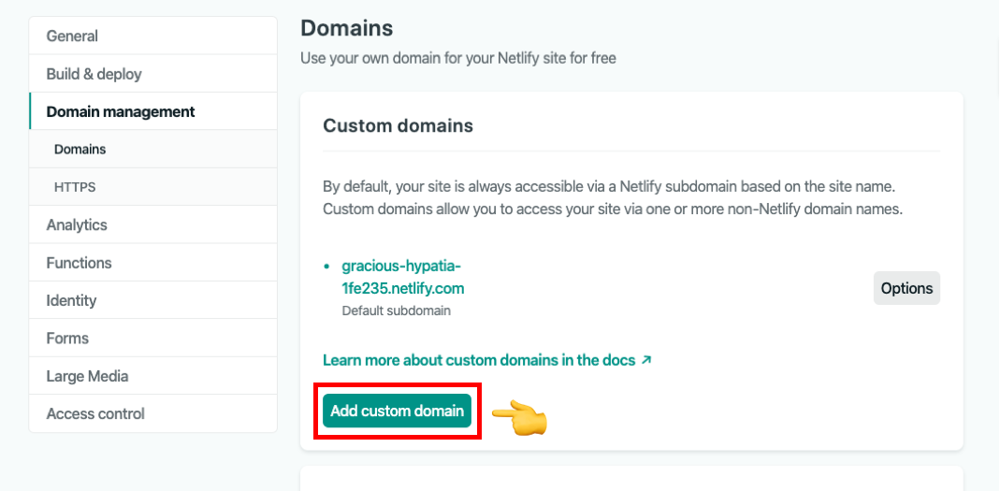

From there, follow the steps to add your domain.

## 4️⃣ Go Live

### Last Steps

👉🏼 Be sure to clear out the data pre-loaded into the table you created in Airtable. Keep the national resources if you'd like, but add in some organizations you know of in your city.

👉🏼 In that Airtable table, there's a column called `Approved`. In order to have any given entry show up on the deployed site, that column needs to be set to `Yes`.

👉🏼 In that Airtable table, there's also a column called `PageCategory`. In order to have a whole category show up on a specific page (i.e. have `Soup Kitchens` show up on the `Food and Finance` page), that column needs to be manually set to a provided page name for each individual row in a category. It's important that you don't add your own `PageCategory` values for now. That customization is coming in a future release.

👉🏼 For now, after events are added to Airtable, you need to trigger a manual deploy on Netlify. 

* From the Netlify Overview page of your site, head to the `Deploys` page. 
* Under the `Trigger deploy` dropdown on the right side of that page, select `Deploy sites`. 
* After a couple of minutes, Netlify should deploy the latest changes. Refresh your site to double check.

## 5️⃣ Local Development

### Preparation steps

👉🏻 Clone the repos for the [Relief Resources Starter](https://github.com/MayDayStrike/gatsby-starter-mds-mutual-aid) and [Relief Resources Theme](https://github.com/MayDayStrike/gatsby-theme-mds-mutual-aid) to your local machine.

👉🏻 In your terminal, `cd` into each directory you just cloned and run `npm install`.

👉🏻 You'll still need Airtable set up to feed data into your local site, so please go through step `2. Set up data source` of this README. Throw the keys you need to gather into a text file - you'll need them for a later step.

### NPM link local theme repo

👉🏻 For developing a Gatsby theme locally, you want to be able to see the changes without having to publish your package every five minutes. To do that, we're going to use `npm link`.

Here's a [good article](https://medium.com/@the1mills/how-to-test-your-npm-module-without-publishing-it-every-5-minutes-1c4cb4b369be) for understanding `npm link` a little better.

👉🏻 Under the hood, what this is doing is creating a symlink so that when you run `gatsby build` in your local `gatsby-starter-relief-resources` repo, it calls your local `gatsby-theme-relief-resources` repo rather than the published package via NPM.

👉🏻 After running `npm install` in both of your freshly cloned repos, the following commands should handle the link for you:

```bash
cd <gatsby-theme-relief-resources-root>
npm link # create a global symlink to the local "gatsby theme" project
cd <gatsby-starter-relief-resources-root>
npm link gatsby-theme-relief-resources # create a symlink locally to global "gatsby theme" symlink
```

### Create .env file

👉🏻 In the root of your local `gatsby-starter-relief-resources` repo, create a `.env.development` file and fill it with the following:

```env
AIRTABLE_API_KEY=yourAPIKey
AIRTABLE_BASE_ID=yourBaseID
AIRTABLE_EMBED_ID=yourEmbedID
AIRTABLE_TABLE_NAME=yourTableName
CITY=yourCity
STATE=yourState
```

These environment variables will filter into the `gatsby-config.js` file in your local `gatsby-theme-relief-resources` repo to be distributed where needed at build-time.

### Gatsby Develop

👉🏻 When all of the above is done, you should be able to run `gatsby develop` in your local `gatsby-starter-relief-resources` repo. After the build completes, open a browser and check `localhost:80000` to make sure everything built correctly.

👉🏻 When making changes in your local `gatsby-theme-relief-resources` repo, you may have to (for changes in Airtable, you WILL have to) `ctrl-c` out of your `gatsby develop` terminal pane and kick off another develop build to see the changes.

_MORE @TODO_
